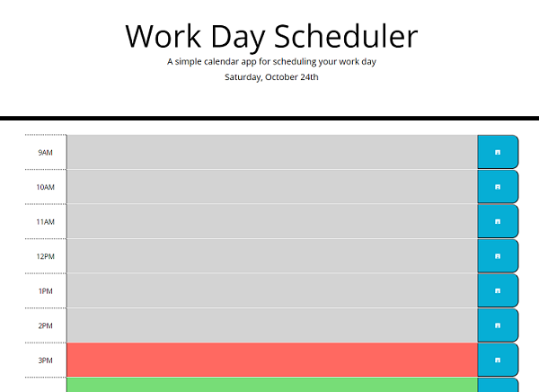

# work-day-scheduler

A day planner for a single day's business hours.

Time blocks are color-coded relative to the current time.

Notes can be saved and stored locally.

## Unused features

- Hourly color-coding updates

- Stored data cleared at midnight

###### ~Only one screenshot doesn't need a collapsable section right?~

Deployment: [Work Day Scheduler](https://ducktrshessami.github.io/work-day-scheduler/)
